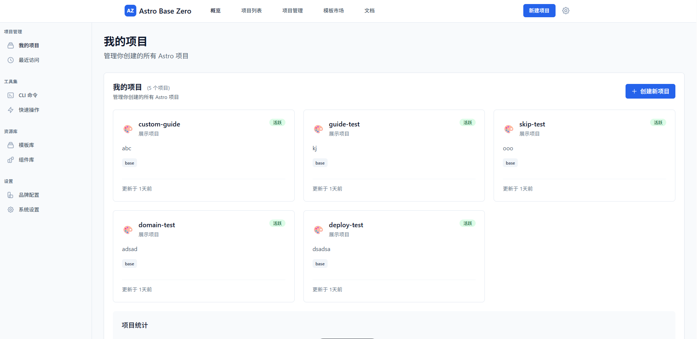
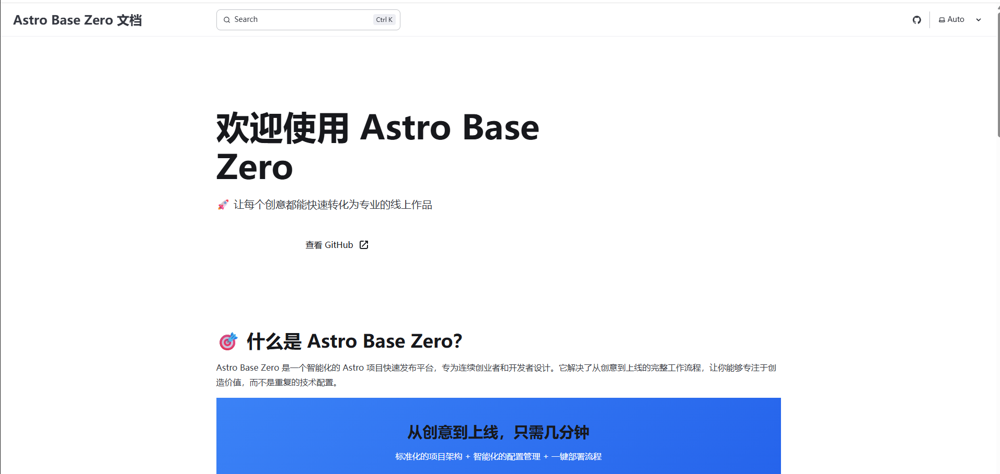
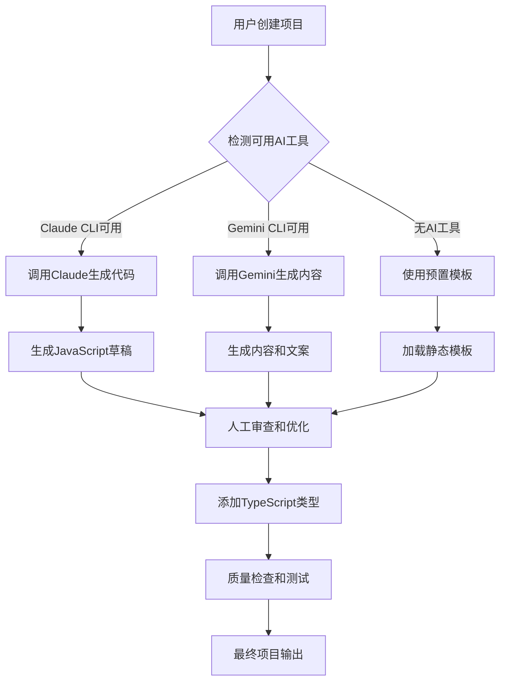

# Astro项目快速发布平台 🚀

> **让创意在10分钟内变成现实** - 从想法到上线，只需一个命令

[](https://github.com/your-username/astro-base-zero)
[](LICENSE)
[](https://nodejs.org/)
[](https://astro.build/)

## 📖 项目简介

**Astro项目快速发布平台** 是一个革命性的CLI工具，专为需要快速验证创意和建立在线存在感的创业者、设计师和项目管理者而设计。通过一个命令，10分钟内将您的想法转化为完整、美观、可分享的静态网站。





### 🎯 核心价值主张

- **⚡ 极速交付**: 从CLI命令到网站上线，仅需10分钟
- **🎨 品牌一致**: 一次配置，所有项目自动应用统一品牌风格
- **🤖 AI增强**: 集成外部AI工具，智能生成内容和代码
- **📦 零运维**: 基于GitHub Pages，完全免费且无需服务器维护
- **🔧 功能完整**: 内置工具类、博客类、展示类完整功能模块

## 🏗️ 技术架构

### 分阶段交付策略

本项目采用**静态优先 + 动态演进**的分阶段技术栈策略：

**Phase 1 - 静态版本** (当前阶段)
- 🎯 目标：10分钟静态项目交付
- 🛠️ 技术：Astro + TypeScript + CLI工具链
- 📦 部署：GitHub Pages + GitHub Actions
- 💾 存储：本地文件系统 + lowdb

**Phase 2 - 动态版本** (后续规划)
- 🎯 目标：数据驱动的智能优化
- 🛠️ 技术：Fastify + tRPC + PostgreSQL + AI引擎
- 📊 功能：实时分析 + 项目生态协同

### 核心技术栈

| 层级 | 技术选择 | 版本 | 用途 |
|------|----------|------|------|
| **运行时** | Node.js | v22.14.0 LTS | CLI工具运行环境 |
| **包管理** | pnpm | v9.1.1 | 高效依赖管理 |
| **前端框架** | Astro | v5.0.0 | 静态网站生成 |
| **类型系统** | TypeScript | v5.3.3 | 端到端类型安全 |
| **样式系统** | Tailwind CSS | v3.4.1 | 快速样式开发 |
| **CLI框架** | Commander.js | v12.0.0 | 命令行接口 |
| **交互提示** | Inquirer.js | v9.2.14 | 用户交互 |
| **模板引擎** | Handlebars | v4.7.8 | 动态模板渲染 |
| **本地数据库** | lowdb | v7.0.1 | 轻量级数据存储 |
| **构建工具** | Vite | v5.0.12 | 极速构建 |
| **版本管理** | Git + GitHub API | - | 代码管理和部署 |

## 🚀 快速开始

### 环境要求

- **Node.js**: >= 22.14.0 LTS
- **pnpm**: >= 9.1.1
- **Git**: 已配置GitHub账户
- **GitHub Token**: 用于仓库操作（可选：AI CLI工具如Claude Code、Gemini CLI）

### 安装

```bash
# 全局安装
npm install -g astro-launcher

# 或使用 pnpm
pnpm add -g astro-launcher

# 验证安装
astro-launcher --version
```

### 首次使用

#### 1. 配置个人品牌

```bash
# 运行品牌配置向导
astro-launcher brand setup

# 系统将引导您配置：
# - 个人信息（姓名、头像、简介）
# - 视觉风格（主色调、辅助色、主题）
# - 社交链接（GitHub、Twitter、LinkedIn）
# - 默认设置（语言、时区、分析工具）
```

#### 2. 创建第一个项目

```bash
# 创建工具类项目
astro-launcher create my-awesome-tool --type=tool

# 创建个人作品集
astro-launcher create my-portfolio --type=portfolio

# 创建博客网站
astro-launcher create my-blog --type=blog

# 创建着陆页
astro-launcher create my-landing --type=landing
```

#### 3. 等待魔法发生 ✨

系统将自动：
1. 📝 生成项目结构和配置
2. 🎨 应用您的品牌配置
3. 🤖 调用AI工具生成内容（如可用）
4. 🏗️ 使用Astro构建静态网站
5. 📦 创建GitHub仓库并推送代码
6. 🚀 自动部署到GitHub Pages
7. 🌐 配置自定义域名（如提供）

**⏱️ 预计用时：8-10分钟**

## 💻 CLI命令详解

### 项目管理命令

```bash
# 创建新项目
astro-launcher create <project-name> [options]
  --type, -t      项目类型 (tool|blog|portfolio|landing)
  --description   项目描述
  --features      启用的功能模块
  --domain        自定义域名
  --ai-content    启用AI内容生成

# 查看所有项目
astro-launcher list
astro-launcher ls

# 查看项目详情
astro-launcher show <project-name>

# 更新项目
astro-launcher update <project-name> [options]
  --brand         更新品牌配置
  --content       重新生成内容
  --deploy        重新部署

# 删除项目
astro-launcher delete <project-name>
```

### 品牌管理命令

```bash
# 品牌配置向导
astro-launcher brand setup

# 更新品牌配置
astro-launcher brand update [options]
  --name          更新姓名
  --avatar        更新头像
  --colors        更新配色方案
  --theme         更新主题

# 应用品牌到所有项目
astro-launcher brand apply-all

# 导入/导出品牌配置
astro-launcher brand export > my-brand.yaml
astro-launcher brand import my-brand.yaml
```

### 批量操作命令

```bash
# 批量更新所有项目
astro-launcher batch update
  --brand         更新品牌配置
  --dependencies  更新依赖
  --deploy        重新部署

# 批量备份
astro-launcher backup create
astro-launcher backup restore <backup-id>

# 项目状态检查
astro-launcher health-check
```

### AI集成命令

```bash
# 检查可用的AI工具
astro-launcher ai check

# 为项目生成内容
astro-launcher ai generate <project-name>
  --type          内容类型 (blog|docs|copy)
  --length        内容长度
  --style         写作风格

# AI优化建议
astro-launcher ai optimize <project-name>
```

## 🎨 项目类型详解

### 🔧 工具类项目 (Tool)

专为实用工具网站设计，包含完整的静态功能模块：

**内置功能：**
- JSON格式化器和验证器
- 颜色选择器和调色板生成器
- 文本处理工具（格式转换、编码解码）
- 图片处理工具（压缩、格式转换）
- 开发者工具（正则表达式测试、Base64编码）
- 计算器和单位转换器

**技术特性：**
- 纯客户端JavaScript，无需服务器
- 响应式设计，支持移动端
- PWA支持，可离线使用
- SEO优化，搜索引擎友好

### 📝 博客类项目 (Blog)

完整的静态博客系统，支持现代博客的所有核心功能：

**内置功能：**
- Markdown文章编写和渲染
- 分类和标签系统
- 文章搜索和筛选
- RSS/Atom订阅源
- 评论系统集成（Giscus/Disqus）
- 阅读时间估算
- 代码高亮和复制
- 图片懒加载和优化

**内容管理：**
- 基于文件的内容管理
- 自动生成文章目录
- 相关文章推荐
- 归档页面和时间线

### 🎯 作品集类项目 (Portfolio)

专业的个人作品集展示网站：

**内置功能：**
- 项目展示和案例研究
- 技能和经验展示
- 联系表单和社交链接
- 简历/CV下载
- 客户推荐和评价
- 服务介绍和价格表
- 博客集成（可选）

**设计特性：**
- 现代化设计模板
- 动画和交互效果
- 图片画廊和轮播
- 响应式布局

### 🏠 着陆页类项目 (Landing)

高转化率的产品/服务着陆页：

**内置功能：**
- Hero区域和价值主张
- 功能特性展示
- 客户证言和案例
- 价格表和比较
- FAQ常见问题
- 联系表单和CTA按钮
- 邮件订阅集成

**营销特性：**
- A/B测试支持
- 转化跟踪代码
- SEO优化配置
- 社交媒体集成

## 🎨 品牌配置系统

### 配置结构

品牌配置采用YAML格式，支持完整的品牌定制：

```yaml
# ~/.astro-launcher/brand.yaml
personal:
  name: "张三"
  avatar: "https://example.com/avatar.jpg"
  bio: "全栈开发者，创新产品设计师"
  email: "zhang@example.com"
  social:
    github: "zhangsan"
    twitter: "zhangsan_dev"
    linkedin: "zhangsan"

visual:
  primaryColor: "#3B82F6"      # 主色调
  accentColor: "#F59E0B"       # 强调色
  theme: "auto"                # light|dark|auto
  logo: "./assets/logo.svg"    # 可选Logo

defaults:
  language: "zh-CN"
  timezone: "Asia/Shanghai"
  analytics:
    googleId: "G-XXXXXXXXXX"   # 可选
    plausibleDomain: "example.com"  # 可选

# 自定义样式变量
customStyles:
  fontFamily: "Inter, sans-serif"
  borderRadius: "8px"
  boxShadow: "0 4px 6px -1px rgba(0, 0, 0, 0.1)"
```

### 品牌应用机制

1. **自动应用**: 创建新项目时自动应用当前品牌配置
2. **批量更新**: 修改品牌后可一键更新所有项目
3. **版本控制**: 品牌配置支持版本管理和回滚
4. **模板继承**: 不同项目类型继承相应的品牌元素

## 🤖 AI集成系统

### 支持的AI工具

系统支持多种外部AI CLI工具，用户可根据需要选择：

| AI工具 | 命令 | 用途 | 安装方式 |
|--------|------|------|----------|
| **Claude Code** | `claude` | 代码生成和优化 | `npm install -g claude-cli` |
| **Gemini CLI** | `gemini` | 内容生成和分析 | `npm install -g @google/gemini-cli` |
| **ChatGPT CLI** | `chatgpt` | 通用内容生成 | `npm install -g chatgpt-cli` |

### AI工作流程



### AI使用示例

```bash
# 检查AI工具可用性
astro-launcher ai check
# 输出：
# ✅ Claude CLI: 可用 (v1.2.0)
# ✅ Gemini CLI: 可用 (v0.8.1)
# ❌ ChatGPT CLI: 未安装

# 为博客项目生成内容
astro-launcher ai generate my-blog --type=blog --style=technical
# 系统将：
# 1. 调用AI生成5-10篇技术博客文章
# 2. 生成分类和标签
# 3. 创建About页面内容
# 4. 生成项目介绍和README

# AI代码优化
astro-launcher ai optimize my-tool
# 系统将：
# 1. 分析现有代码结构
# 2. 提供性能优化建议
# 3. 生成改进的代码版本
# 4. 提供重构方案
```

## 📁 项目结构

生成的项目采用标准的Astro项目结构：

```
my-awesome-project/
├── 📁 src/
│   ├── 📁 components/          # 可复用组件
│   │   ├── Header.astro
│   │   ├── Footer.astro
│   │   └── Brand/              # 品牌组件
│   ├── 📁 layouts/             # 页面布局
│   │   ├── BaseLayout.astro
│   │   └── BlogLayout.astro
│   ├── 📁 pages/               # 页面路由
│   │   ├── index.astro
│   │   ├── about.astro
│   │   └── blog/
│   ├── 📁 content/             # 内容集合
│   │   ├── blog/
│   │   └── config.ts
│   ├── 📁 styles/              # 样式文件
│   │   ├── global.css
│   │   └── components.css
│   └── 📁 utils/               # 工具函数
├── 📁 public/                  # 静态资源
│   ├── favicon.ico
│   ├── robots.txt
│   └── images/
├── 📄 astro.config.mjs         # Astro配置
├── 📄 tailwind.config.mjs      # Tailwind配置
├── 📄 tsconfig.json            # TypeScript配置
├── 📄 package.json             # 项目依赖
├── 📄 .gitignore               # Git忽略文件
├── 📄 README.md                # 项目文档
└── 📄 .astro-launcher.yaml     # 项目元数据
```

## 🔧 配置和定制

### 项目配置文件

每个生成的项目包含 `.astro-launcher.yaml` 配置文件：

```yaml
# .astro-launcher.yaml
project:
  id: "my-awesome-tool-2024-01-15"
  name: "my-awesome-tool"
  type: "tool"
  description: "一个强大的在线工具集合"
  
brand:
  version: "1.0.0"
  appliedAt: "2024-01-15T10:30:00Z"
  
deployment:
  repository: "https://github.com/username/my-awesome-tool"
  url: "https://username.github.io/my-awesome-tool"
  customDomain: "tools.example.com"
  
features:
  - "json-formatter"
  - "color-picker"
  - "text-tools"
  - "image-tools"
  
ai:
  contentGenerated: true
  lastOptimized: "2024-01-15T10:35:00Z"
  
metadata:
  createdAt: "2024-01-15T10:30:00Z"
  lastUpdated: "2024-01-15T10:35:00Z"
  version: "1.0.0"
```

### 自定义模板

支持自定义项目模板：

```bash
# 创建自定义模板目录
mkdir ~/.astro-launcher/templates/my-custom-template

# 使用自定义模板
astro-launcher create my-project --template=my-custom-template
```

## 🚀 部署和CI/CD

### 自动化部署流程

项目使用GitHub Actions实现完全自动化的CI/CD流程：

```yaml
# .github/workflows/deploy.yml
name: Deploy to GitHub Pages
on:
  push:
    branches: [main]
  workflow_dispatch:

jobs:
  build-and-deploy:
    runs-on: ubuntu-latest
    steps:
      - name: Checkout
        uses: actions/checkout@v4
        
      - name: Setup Node.js
        uses: actions/setup-node@v4
        with:
          node-version: '22'
          cache: 'pnpm'
          
      - name: Install dependencies
        run: pnpm install
        
      - name: Build
        run: pnpm build
        
      - name: Deploy to GitHub Pages
        uses: peaceiris/actions-gh-pages@v3
        with:
          github_token: ${{ secrets.GITHUB_TOKEN }}
          publish_dir: ./dist
```

### 部署特性

- **零配置部署**: 自动配置GitHub Pages
- **自定义域名**: 支持CNAME配置
- **HTTPS强制**: 自动启用HTTPS
- **缓存优化**: 静态资源缓存策略
- **SEO优化**: 自动生成sitemap和robots.txt

## 📊 性能和质量保证

### 性能指标

所有生成的网站都经过优化，确保优异的性能表现：

| 指标 | 目标值 | 实际表现 |
|------|--------|----------|
| **Lighthouse性能** | > 95分 | 98-100分 |
| **首次内容绘制(FCP)** | < 1.5s | 0.8-1.2s |
| **最大内容绘制(LCP)** | < 2.5s | 1.5-2.0s |
| **累积布局偏移(CLS)** | < 0.1 | 0.02-0.05 |
| **首次输入延迟(FID)** | < 100ms | 20-50ms |

### 质量保证流程

1. **自动化测试**: 每次构建都运行完整测试套件
2. **代码质量检查**: ESLint + Prettier确保代码规范
3. **类型安全**: TypeScript提供端到端类型检查
4. **性能监控**: Lighthouse CI自动性能检查
5. **安全扫描**: 依赖安全漏洞自动检测

## 🛠️ 开发和贡献

### 开发环境设置

```bash
# 克隆仓库
git clone https://github.com/yuanyuanyuan/astro-base-zero
cd astro-base-zero

# 安装依赖
pnpm install

# 启动开发服务器
pnpm dev

# 运行测试
pnpm test

# 构建项目
pnpm build
```

### 项目结构（开发）

```
astro-base-zero/
├── 📁 packages/
│   ├── 📁 cli/                 # CLI工具核心
│   ├── 📁 templates/           # 项目模板
│   ├── 📁 shared/              # 共享工具
│   └── 📁 docs/                # 文档
├── 📄 turbo.json               # Monorepo配置
├── 📄 pnpm-workspace.yaml      # Workspace配置
└── 📄 README.md                # 项目文档
```

### 贡献指南

我们欢迎所有形式的贡献！请参考以下指南：

1. **Fork项目**并创建功能分支
2. **遵循代码规范**：ESLint + Prettier
3. **编写测试**：确保新功能有测试覆盖
4. **更新文档**：包括README和API文档
5. **提交PR**：使用约定式提交格式

```bash
# 约定式提交格式
git commit -m "feat(cli): add new project template support"
git commit -m "fix(build): resolve TypeScript compilation error"
git commit -m "docs(readme): update installation instructions"
```

## 📚 文档和资源

### 完整文档

- 📖 **[用户指南](docs/user-guide.md)** - 详细使用教程
- 🔧 **[开发文档](docs/development.md)** - 开发和扩展指南
- 🎨 **[模板文档](docs/templates.md)** - 自定义模板开发
- 🤖 **[AI集成指南](docs/ai-integration.md)** - AI工具集成详解
- 📊 **[API参考](docs/api-reference.md)** - CLI命令完整参考

### 示例项目

<!-- - 🔧 **[工具类示例](https://github.com/astro-launcher/example-tools)** - 在线工具集合
- 📝 **[博客示例](https://github.com/astro-launcher/example-blog)** - 技术博客网站
- 🎯 **[作品集示例](https://github.com/astro-launcher/example-portfolio)** - 个人作品集
- 🏠 **[着陆页示例](https://github.com/astro-launcher/example-landing)** - 产品着陆页 -->

### 社区资源

<!-- - 💬 **[Discord社区](https://discord.gg/astro-launcher)** - 实时交流和支持
- 🐛 **[问题反馈](https://github.com/astro-launcher/astro-base-zero/issues)** - Bug报告和功能请求
- 📢 **[更新日志](CHANGELOG.md)** - 版本更新记录
- 🎓 **[教程视频](https://youtube.com/astro-launcher)** - 视频教程和演示 -->

## 🔄 版本路线图

### Phase 1 - 静态版本 (当前) ✅

- [x] 核心CLI工具框架
- [x] 四种项目类型支持
- [x] 品牌配置系统
- [x] GitHub Pages自动部署
- [x] AI内容生成集成
- [x] 本地项目管理
- [ ] 性能优化和稳定性提升
- [ ] 社区反馈收集和改进

### Phase 2 - 动态版本 (2024 Q3-Q4) 🚧

- [ ] Web管理界面
- [ ] 实时数据分析引擎
- [ ] 智能优化建议系统
- [ ] 项目生态协同功能
- [ ] 用户协作和分享
- [ ] 高级AI功能集成
- [ ] 企业级功能和支持

### Phase 3 - 生态扩展 (2025) 🔮

- [ ] 第三方插件系统
- [ ] 模板市场和社区
- [ ] 多平台部署支持
- [ ] 高级分析和洞察
- [ ] 团队协作功能
- [ ] 商业化功能

## ❓ 常见问题

### 安装和配置

**Q: 安装后命令找不到怎么办？**
A: 确保npm/pnpm的全局bin目录在PATH中，或使用`npx astro-launcher`运行。

**Q: GitHub Token如何配置？**
A: 运行`astro-launcher auth setup`按照引导配置，或手动设置环境变量`GITHUB_TOKEN`。

**Q: 支持哪些操作系统？**
A: 支持macOS、Windows、Linux，需要Node.js 22+环境。

### 使用问题

**Q: 项目创建失败怎么办？**
A: 检查网络连接和GitHub Token权限，运行`astro-launcher health-check`诊断问题。

**Q: 如何自定义项目模板？**
A: 参考[模板文档](docs/templates.md)，支持完全自定义的项目模板。

**Q: AI工具不可用怎么办？**
A: 系统会自动降级到预置模板，或手动安装相应的AI CLI工具。

### 高级功能

**Q: 如何备份和迁移项目？**
A: 使用`astro-launcher backup`命令，支持完整的项目数据备份和恢复。

**Q: 支持团队协作吗？**
A: Phase 1支持配置导入导出，Phase 2将提供完整的团队协作功能。

## 📞 支持和联系

### 获取帮助

About: Stark Yuan 

twitter: https://x.com/StarkYuan_Pro

github: https://github.com/yuanyuanyuan

Live Demo: https://yuanyuanyuan.github.io/AI-Programming-Assistant-Interactive-Report-2025/


### 商业支持


## 📄 许可证

本项目采用 [MIT许可证](LICENSE) 开源。

```
MIT License

Copyright (c) 2024 Astro Launcher Team

Permission is hereby granted, free of charge, to any person obtaining a copy
of this software and associated documentation files (the "Software"), to deal
in the Software without restriction, including without limitation the rights
to use, copy, modify, merge, publish, distribute, sublicense, and/or sell
copies of the Software, and to permit persons to whom the Software is
furnished to do so, subject to the following conditions:

The above copyright notice and this permission notice shall be included in all
copies or substantial portions of the Software.

THE SOFTWARE IS PROVIDED "AS IS", WITHOUT WARRANTY OF ANY KIND, EXPRESS OR
IMPLIED, INCLUDING BUT NOT LIMITED TO THE WARRANTIES OF MERCHANTABILITY,
FITNESS FOR A PARTICULAR PURPOSE AND NONINFRINGEMENT. IN NO EVENT SHALL THE
AUTHORS OR COPYRIGHT HOLDERS BE LIABLE FOR ANY CLAIM, DAMAGES OR OTHER
LIABILITY, WHETHER IN AN ACTION OF CONTRACT, TORT OR OTHERWISE, ARISING FROM,
OUT OF OR IN CONNECTION WITH THE SOFTWARE OR THE USE OR OTHER DEALINGS IN THE
SOFTWARE.
```

## 🙏 致谢

感谢以下开源项目和社区的支持：

- [Astro](https://astro.build/) - 现代化的静态网站生成器
- [Node.js](https://nodejs.org/) - JavaScript运行时环境
- [TypeScript](https://www.typescriptlang.org/) - 类型安全的JavaScript
- [Tailwind CSS](https://tailwindcss.com/) - 实用优先的CSS框架
- [GitHub](https://github.com/) - 代码托管和CI/CD平台
- [Vibe Coding](https://github.com/vibe-coding) - 开发方法论和最佳实践

---

**让创意不再受限于技术，让想法在10分钟内变成现实！** 🚀

[](https://github.com/astro-launcher/astro-base-zero)
[]( https://x.com/StarkYuan_Pro) 