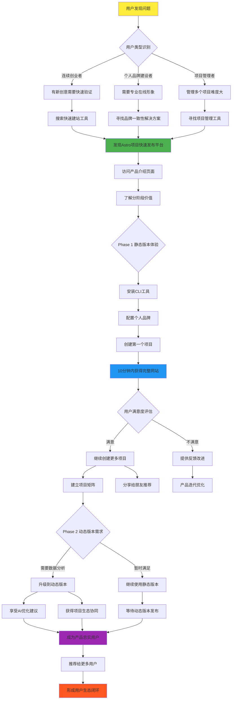
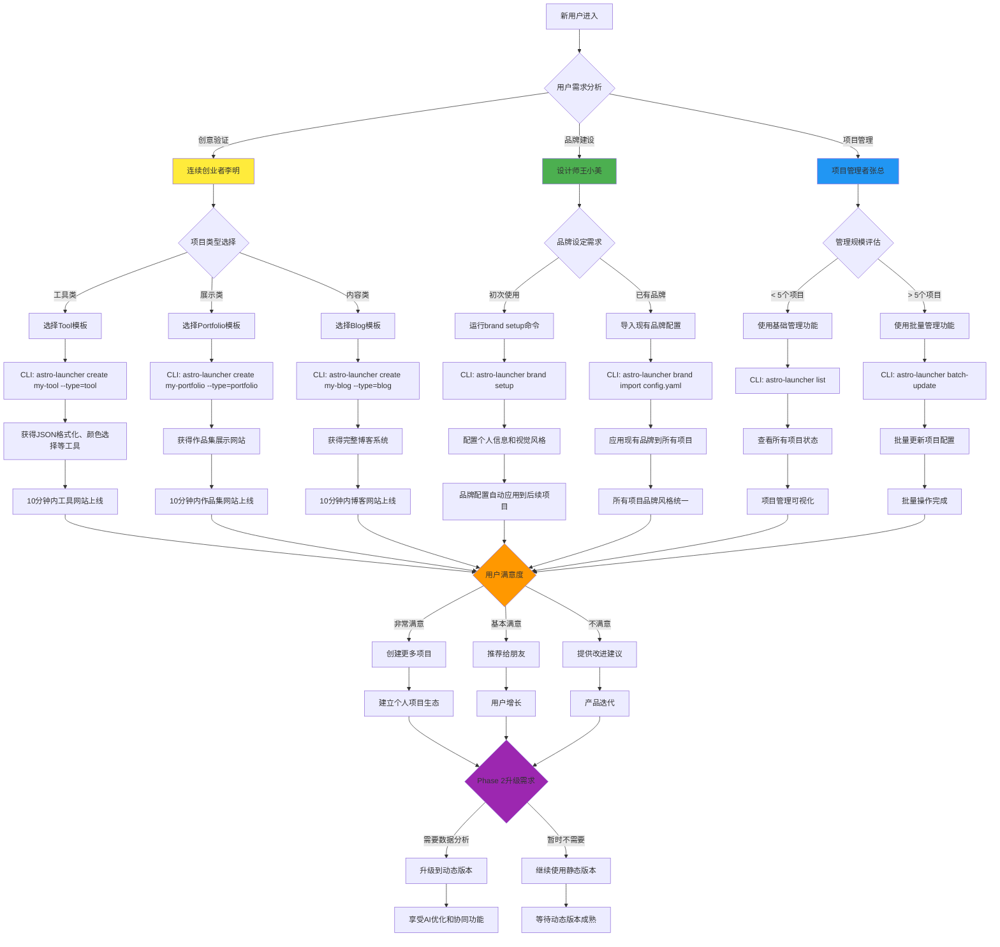

# Astro项目快速发布平台 - 产品需求文档 (PRD) v3.0 分阶段交付版

**版本:** 3.0 (分阶段交付版)  
**日期:** 2025-07-12  
**作者:** Vibe-coding 架构专家  
**重大决策:** 投资人要求分阶段交付，保持最终目标不变  
**核心策略:** 静态版本先行，动态版本后续，渐进式价值实现

---

## 1. 需求洞察与穿透（差异比较法深度分析）

### 1.1 投资人决策背景的深度洞察

**核心问题重新定义：为什么投资人要求分阶段交付，而不是一次性交付完整产品？**

#### 投资人决策动因分析（差异比较法）

| **维度**       | **一次性交付**      | **投资人放弃的原因**  | **分阶段交付**          | **投资人选择的真实驱动因素**  |
|--------------|----------------|-----------------|---------------------|--------------------|
| **资金风险**   | 大额投资，结果不确定 | 投资回报周期长，风险高 | → **小额验证，快速迭代** | 降低投资风险，快速获得市场反馈 |
| **市场验证**   | 完整产品一次性推出  | 市场接受度未知        | → **MVP快速测试**       | 用最小成本验证产品市场契合度  |
| **技术复杂度** | 全功能一次性开发    | 技术风险过高          | → **渐进式复杂度**      | 技术风险可控，逐步验证可行性   |
| **竞争优势**   | 等待完整产品上线    | 竞争对手抢占市场      | → **快速占领细分市场**  | 尽早建立市场地位和用户基础    |
| **资源优化**   | 前期投入巨大        | 资源利用效率低        | → **精益开发，按需投入** | 资源配置更加灵活和高效        |

#### 关键洞察：投资人的真实需求

1. **"我要验证，不要赌博"** - 通过静态版本快速验证产品价值假设
2. **"我要现金流，不要理想"** - 静态版本能够快速产生用户价值和潜在收入
3. **"我要护城河，不要同质化"** - 分阶段建立技术壁垒和用户粘性
4. **"我要数据，不要猜测"** - 用真实用户数据指导后续产品决策

### 1.2 用户需求的场景化深度分析

#### 场景1：急于验证创意的连续创业者李明

**Who:** 有15+个项目想法的技术创业者  
**When:** 每周末都有新想法需要快速验证  
**Where:** 在家办公，习惯用CLI工具  
**What:** 想要在72小时内将想法变成可展示的网站  
**Why:** 获得早期用户反馈，决定是否深入开发  
**How:** 期望通过简单描述就能获得完整的静态网站  

**静态版本价值：** 立即满足快速验证需求，无需等待完整产品
**动态版本价值：** 后续提供用户行为分析和智能优化建议

#### 场景2：寻求个人品牌建设的设计师王小美

**Who:** 自由职业设计师，技术能力有限  
**When:** 准备求职或接大项目时  
**Where:** 在线作品集和社交媒体展示  
**What:** 需要专业的个人品牌网站矩阵  
**Why:** 建立专业形象，获得更好的工作机会  
**How:** 上传作品就能自动生成品牌一致的网站群  

**静态版本价值：** 立即提供专业的静态作品集网站
**动态版本价值：** 后续提供访客行为分析和作品推荐优化

### 1.3 用户旅程图（完整体验路径）

以下是用户从发现问题到形成产品生态的完整旅程：



### 1.4 用户场景适用流程图（决策路径）

以下是不同用户类型的具体使用路径和决策过程：



---

## 2. 核心待完成的工作 (JTBD) - 分阶段实现

### 2.1 静态版本核心JTBD（Phase 1 - 立即交付）

#### JTBD #1-Static: 创意到静态成果的零摩擦转化器
**描述：** 当我有一个项目创意时，帮助我在10分钟内获得一个完整、美观、可分享的静态网站，让我能够立即开始收集用户反馈和建立在线存在感，而不需要任何技术实现。

**核心价值：** 将创意验证周期从"数周"缩短到"10分钟"
**技术约束：** 纯静态生成，GitHub Pages部署，CLI工具驱动

#### JTBD #2-Static: 个人品牌的自动化静态展示系统
**描述：** 当我需要建立专业的在线形象时，帮助我通过一次配置就能在所有项目中自动应用一致的品牌元素，让每个新的静态网站都成为我个人品牌的自然延伸。

**核心价值：** 将品牌建设从"手动维护"转为"自动一致"
**技术约束：** 本地品牌配置，静态模板注入，文件系统存储

### 2.2 动态版本扩展JTBD（Phase 2 - 后续实现）

#### JTBD #1-Dynamic: 数据驱动的智能优化引擎
**描述：** 当我的静态网站开始获得流量时，帮助我通过用户行为数据分析和AI驱动的优化建议，持续改进网站表现，实现从静态展示到动态增长的升级。

**核心价值：** 将网站运营从"静态维护"转为"动态优化"
**技术约束：** 需要后端数据库，实时数据处理，AI分析引擎

#### JTBD #2-Dynamic: 项目生态的协同增长网络
**描述：** 当我管理多个项目时，帮助我通过智能的跨项目数据分析和自动化推荐，实现项目间的流量互导和价值放大，构建个人数字资产的复利增长引擎。

**核心价值：** 将项目管理从"单点维护"转为"生态协同"
**技术约束：** 需要数据库，实时数据同步，智能推荐算法

---

## 3. 用户故事设计（分阶段MoSCoW排序）

### 3.1 Phase 1 - 静态版本 Must Have（立即交付）

**US-S001: 10分钟静态项目交付**
- **作为** 有创意想法的创业者
- **我想要** 通过CLI工具描述需求，10分钟内获得完整的静态网站
- **以便于** 我能立即分享给潜在用户获得反馈（支撑JTBD #1-Static）
- **验收标准：** 
  - CLI命令执行后10分钟内网站可访问
  - 网站包含完整的静态功能（工具类、展示类、博客类）
  - 自动配置GitHub Pages和自定义域名
  - Lighthouse评分 >95分

**US-S002: 零配置品牌静态化**
- **作为** 建设个人品牌的专业人士
- **我想要** 一次品牌配置，所有生成的静态网站自动应用
- **以便于** 建立一致的专业形象（支撑JTBD #2-Static）
- **验收标准：**
  - 一次CLI配置，所有项目自动应用品牌
  - 静态网站视觉一致性达到98%
  - 自动生成项目间的静态导航链接

**US-S003: 完整功能静态组件库**
- **作为** 需要特定功能的项目创建者
- **我想要** 系统自动包含完整的静态功能模块
- **以便于** 网站立即可用，无需额外开发（支撑JTBD #1-Static）
- **验收标准：**
  - 工具类项目包含完整的静态工具功能
  - 博客项目包含完整的静态博客系统
  - 展示类项目包含完整的静态展示功能

### 3.2 Phase 1 - 静态版本 Should Have（优先实现）

**US-S004: 本地项目管理系统**
- **作为** 管理多个项目的创建者
- **我想要** 通过本地CLI工具管理所有项目
- **以便于** 统一维护和更新所有静态网站
- **验收标准：**
  - CLI提供项目列表和状态查看
  - 支持批量更新和配置同步
  - 本地数据备份和恢复功能

**US-S005: 静态内容AI生成**
- **作为** 内容创作者
- **我想要** CLI工具自动生成高质量的静态内容
- **以便于** 网站有丰富的初始内容
- **验收标准：**
  - 基于项目类型自动生成相关静态内容
  - 内容质量达到可直接发布标准
  - 支持内容缓存和离线使用

### 3.3 Phase 2 - 动态版本 Must Have（后续交付）

**US-D001: 实时数据分析引擎**
- **作为** 希望优化网站的创建者
- **我想要** 实时了解用户行为并获得优化建议
- **以便于** 持续改进网站表现（支撑JTBD #1-Dynamic）
- **验收标准：**
  - 实时用户行为数据收集
  - AI驱动的优化建议生成
  - 个性化改进策略推荐

**US-D002: 项目生态智能协同**
- **作为** 管理多个项目的创建者
- **我想要** 系统自动分析项目间关系并优化协同效果
- **以便于** 实现项目间的流量互导和价值放大（支撑JTBD #2-Dynamic）
- **验收标准：**
  - 跨项目数据分析和关系发现
  - 智能推荐和流量导向
  - 生态价值可视化展示

### 3.4 Phase 1 Won't Have（明确不做）

- 实时数据库功能（Phase 2实现）
- 复杂的AI分析（Phase 2实现）
- 用户协作功能（Phase 2实现）
- 付费功能（Phase 2实现）
- 复杂的后端API（Phase 2实现）

---

## 4. 数据契约定义（分阶段演进）

### 4.1 Phase 1 - 静态版本数据契约

```typescript
// 静态项目交付契约
interface StaticProjectDeliverable {
  id: string;
  name: string;
  description: string;
  type: 'tool' | 'blog' | 'portfolio' | 'landing';
  
  // 静态交付结果
  deliverables: {
    websiteUrl: string;           // GitHub Pages URL
    repositoryUrl: string;        // GitHub仓库地址
    buildStatus: 'success' | 'failed' | 'pending';
    deployTime: number;           // 部署耗时（秒）
  };
  
  // 静态功能完整性
  features: {
    staticFeatures: string[];     // 静态功能列表
    brandApplied: boolean;        // 品牌是否应用
    contentGenerated: boolean;    // 内容是否生成
    seoOptimized: boolean;        // SEO是否优化
  };
  
  // 本地存储数据
  localData: {
    configPath: string;           // 本地配置路径
    lastModified: ISO8601;        // 最后修改时间
    backupPath?: string;          // 备份路径
  };
  
  createdAt: ISO8601;
  deployedAt: ISO8601;
}

// 本地品牌配置契约
interface LocalBrandConfig {
  personal: {
    name: string;
    avatar: string;
    bio: string;
    email: string;
    social: {
      github?: string;
      twitter?: string;
      linkedin?: string;
    };
  };
  
  visual: {
    primaryColor: string;
    accentColor: string;
    theme: 'light' | 'dark' | 'auto';
    logo?: string;
  };
  
  defaults: {
    language: 'zh-CN' | 'en-US';
    timezone: string;
    analytics?: {
      googleId?: string;
      plausibleDomain?: string;
    };
  };
}

// CLI命令接口契约
interface CLICommandContract {
  // 项目创建命令
  create: {
    input: {
      name: string;
      type: 'tool' | 'blog' | 'portfolio';
      description?: string;
      features?: string[];
    };
    output: {
      projectId: string;
      repositoryUrl: string;
      websiteUrl: string;
      buildTime: number;
    };
  };
  
  // 品牌配置命令
  brand: {
    input: {
      action: 'setup' | 'update' | 'apply';
      config?: Partial<LocalBrandConfig>;
    };
    output: {
      success: boolean;
      affectedProjects: string[];
      message: string;
    };
  };
}
```

### 4.2 Phase 2 - 动态版本数据契约（预留接口）

```typescript
// 动态数据分析契约（Phase 2）
interface DynamicAnalyticsContract {
  userId: string;
  projectId: string;
  
  // 实时用户行为数据
  userBehavior: {
    pageViews: number;
    uniqueVisitors: number;
    bounceRate: number;
    avgSessionDuration: number;
    conversionRate: number;
  };
  
  // AI优化建议
  optimizations: {
    category: 'performance' | 'content' | 'seo' | 'conversion';
    priority: 'high' | 'medium' | 'low';
    suggestion: string;
    expectedImpact: number;
    implementationEffort: 'low' | 'medium' | 'high';
  }[];
  
  // 项目协同数据
  ecosystem: {
    relatedProjects: string[];
    crossTraffic: number;
    synergyScore: number;
    recommendations: string[];
  };
}

// 动态存储迁移契约
interface DataMigrationContract {
  // 从本地文件到数据库的迁移
  migrateFromLocal: {
    input: {
      localDataPath: string;
      targetDatabaseUrl: string;
    };
    output: {
      migratedRecords: number;
      failedRecords: number;
      migrationTime: number;
    };
  };
  
  // 向后兼容性保证
  compatibility: {
    supportedVersions: string[];
    migrationPath: string;
    rollbackSupport: boolean;
  };
}
```

---

## 5. 分阶段实施策略与验证标准

### 5.1 Phase 1 - 静态版本验证标准

#### 技术验证标准
```yaml
交付速度:
  - 项目创建时间: < 10分钟 (从CLI命令到网站可访问)
  - 构建成功率: > 99%
  - 部署成功率: > 99%

质量标准:
  - Lighthouse评分: > 95分
  - 页面加载时间: < 2秒
  - 跨浏览器兼容性: 100%

功能完整性:
  - 静态功能覆盖率: > 90%
  - 品牌一致性: > 98%
  - 内容质量: > 85分
```

#### 用户验证标准
```yaml
用户体验:
  - CLI学习时间: < 30分钟
  - 首次成功创建率: > 90%
  - 用户满意度: > 8/10

商业价值:
  - 用户留存率: 7天 > 80%
  - 项目分享率: > 70%
  - 推荐意愿: NPS > 50
```

### 5.2 Phase 2 - 动态版本验证标准（预规划）

#### 技术验证标准
```yaml
数据处理:
  - 实时数据延迟: < 5秒
  - 数据处理成功率: > 99.9%
  - 系统可用性: > 99.95%

AI分析:
  - 分析准确率: > 85%
  - 建议采纳率: > 60%
  - 优化效果: 平均提升 > 20%
```

#### 商业验证标准
```yaml
价值提升:
  - 用户项目成功率: 提升 > 50%
  - 跨项目协同效果: 提升 > 30%
  - 用户付费转化率: > 10%
```

---

## 6. 风险评估与缓解策略

### 6.1 Phase 1 - 静态版本风险

#### 技术风险
**风险1: GitHub Pages限制导致功能受限**
- 影响: 某些动态功能无法实现
- 缓解: 设计时优先静态实现，复杂功能延后到Phase 2
- 应急: 提供客户端JavaScript增强功能

**风险2: CLI工具学习成本**
- 影响: 用户采用率下降
- 缓解: 提供图形化引导界面，丰富的使用示例
- 应急: Web界面提供CLI命令生成器

#### 商业风险
**风险3: 静态版本价值感知不足**
- 影响: 用户期望与实际功能不匹配
- 缓解: 明确沟通产品分阶段策略，展示后续路线图
- 应急: 提供Phase 2功能的Beta预览

### 6.2 Phase 2 - 动态版本风险（预评估）

#### 技术风险
**风险4: 数据迁移复杂度**
- 影响: 从静态到动态的升级困难
- 缓解: 设计兼容的数据格式，提供自动迁移工具
- 应急: 混合模式，支持静态和动态并存

**风险5: AI功能稳定性**
- 影响: 动态分析和建议质量不稳定
- 缓解: 多模型集成，人工审核机制
- 应急: 降级到规则基础的分析引擎

---

## 7. 分阶段成功指标

### 7.1 Phase 1 - 静态版本成功指标

```yaml
用户指标:
  - 注册用户数: 1000+ (首月)
  - 活跃用户数: 700+ (首月)
  - 项目创建数: 2000+ (首月)
  - 用户留存率: 7天 > 80%, 30天 > 60%

产品指标:
  - 平均项目创建时间: < 8分钟
  - 项目创建成功率: > 95%
  - 用户满意度: > 8.5/10
  - 功能使用率: 核心功能 > 80%

商业指标:
  - 用户获取成本: < $5
  - 用户推荐率: NPS > 50
  - 市场占有率: 在细分市场 > 10%
  - 品牌认知度: 在目标群体 > 20%
```

### 7.2 Phase 2 - 动态版本成功指标（目标设定）

```yaml
升级指标:
  - 静态版本升级率: > 40%
  - 动态功能使用率: > 70%
  - 用户价值提升: > 50%
  - 付费转化率: > 15%

生态指标:
  - 跨项目协同效果: > 30%
  - 用户项目成功率: > 80%
  - 社区贡献度: > 100个模板
  - 第三方集成: > 20个服务
```

---

## 8. 总结：分阶段价值实现策略

### 8.1 投资人价值实现路径

**Phase 1 - 静态版本（3个月）：**
- **快速市场验证**：用最小成本验证核心价值假设
- **用户基础建立**：建立种子用户群体和品牌认知
- **技术基础夯实**：为Phase 2奠定坚实的技术基础
- **现金流启动**：通过增值服务实现早期现金流

**Phase 2 - 动态版本（6个月）：**
- **价值深化**：通过数据分析和AI优化提升用户价值
- **商业模式成熟**：建立可持续的商业模式
- **竞争壁垒**：建立技术和数据护城河
- **规模化增长**：实现用户和收入的规模化增长

### 8.2 用户价值递进策略

**Level 1 - 静态价值**：立即可用的完整网站
**Level 2 - 品牌价值**：一致的专业形象建立
**Level 3 - 生态价值**：项目间的协同效应
**Level 4 - 智能价值**：数据驱动的持续优化

### 8.3 技术演进策略

**静态优先**：先用静态技术实现核心价值
**渐进增强**：逐步添加动态功能和智能特性
**平滑过渡**：确保用户无感知的技术升级
**向后兼容**：保护用户的既有投资和数据

---

## 9. 行动计划与里程碑

### 9.1 Phase 1 - 静态版本里程碑

**里程碑1：MVP上线（30天）**
- 核心CLI工具完成
- 基础模板库建立
- GitHub Pages自动部署
- 首批10个用户测试

**里程碑2：功能完善（60天）**
- 完整品牌系统
- AI内容生成
- 本地项目管理
- 100个用户使用

**里程碑3：市场验证（90天）**
- 1000+用户注册
- 2000+项目创建
- 用户反馈优化
- Phase 2需求确认

### 9.2 Phase 2 - 动态版本里程碑（预规划）

**里程碑4：动态功能Beta（120天）**
- 数据分析引擎
- 基础AI优化
- 用户数据迁移
- Beta用户测试

**里程碑5：完整产品发布（180天）**
- 完整动态功能
- 商业模式上线
- 大规模用户推广
- 生态伙伴合作

---

**文档状态：** ✅ V3.0 分阶段交付版完成（含完整用户旅程图和场景流程图）  
**核心价值：** 投资风险最小化，用户价值最大化，技术演进最优化  
**可视化文档：** ✅ 用户旅程图、✅ 用户场景适用流程图  
**下一步：** 基于此PRD制定Phase 1的详细技术架构和实施计划 