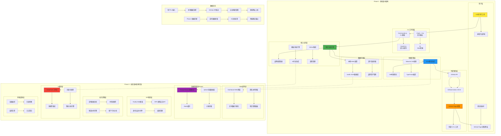
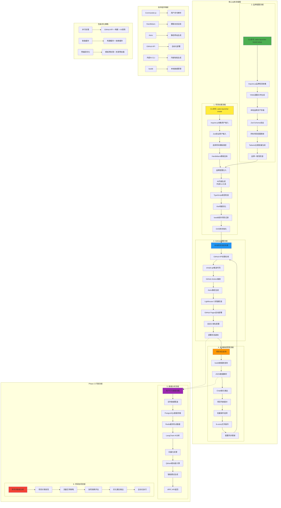
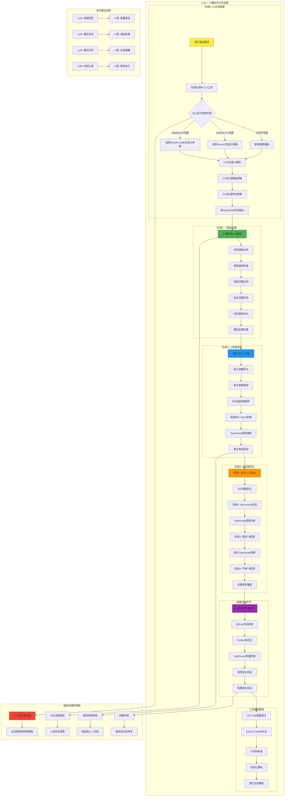

# Astro项目快速发布平台 - 技术栈决策文档 V4.0 分阶段交付版

**版本:** 4.0 (分阶段交付版)  
**日期:** 2025-07-12  
**决策方法:** Vibe-coding 三层滤网分析  
**核心原则:** 尽可能最简单且最健壮的分阶段技术栈  
**投资人要求:** Phase 1静态版本先行，Phase 2动态版本后续  
**决策目标:** 投资风险最小化，技术演进最优化

---

## 🔍 **【第一层滤网】功能性需求分析（它需要"做什么"？）**

### 基于PRD v3.0的功能需求深度分析

```yaml
Phase 1 - 静态版本核心功能:
  10分钟静态项目交付:
    - CLI驱动的项目创建和配置
    - 静态网站生成和优化
    - GitHub Pages自动部署
    - 自定义域名配置
    技术需求: CLI框架、静态生成器、GitHub API集成、构建工具

  零配置品牌静态化:
    - 本地品牌配置管理
    - 静态模板品牌注入
    - 跨项目品牌一致性
    技术需求: 配置管理、模板引擎、文件系统存储

  完整功能静态组件库:
    - 工具类静态功能（JSON格式化、颜色选择器等）
    - 博客类静态功能（文章管理、分类标签）
    - 展示类静态功能（作品集、项目展示）
    技术需求: 组件库、静态资产管理、类型系统

  本地项目管理系统:
    - CLI项目状态管理
    - 批量配置更新
    - 本地数据备份
    技术需求: 本地数据库、CLI工具链、文件系统操作

  静态内容AI生成:
    - CLI内置AI API调用
    - 内容缓存和离线使用
    - 质量评估和优化
    技术需求: AI API集成、本地缓存、内容处理

Phase 2 - 动态版本扩展功能（预留架构）:
  实时数据分析引擎:
    - 用户行为数据收集
    - AI驱动优化建议
    - 个性化策略推荐
    技术需求: 数据库、实时分析、AI服务

  项目生态智能协同:
    - 跨项目数据分析
    - 智能推荐算法
    - 生态价值可视化
    技术需求: 数据库、机器学习、可视化
```

---

## ⚡ **【第二层滤网】非功能性需求分析（它需要"做得多好"？）**

### Phase 1 - 静态版本性能要求

```yaml
极致交付速度:
  目标: 10分钟内完成从CLI命令到网站可访问
  分解:
    - CLI处理时间: < 2分钟
    - 静态生成时间: < 3分钟  
    - GitHub Pages部署: < 4分钟
    - DNS传播: < 1分钟
  技术含义:
    - 构建工具必须极速（Vite级别）
    - 模板渲染必须高效（预编译优化）
    - GitHub API调用必须并行化
    - 缓存策略必须激进

质量保证要求:
  Lighthouse评分: > 95分（静态站点天然优势）
  构建成功率: > 99%
  部署成功率: > 99%
  技术含义:
    - 静态生成确保性能
    - 构建过程必须可靠和幂等
    - 错误处理必须完备
    - 回滚机制必须自动化

运维成本要求:
  部署成本: $0（GitHub Pages免费）
  维护成本: 极低（无服务器运维）
  学习成本: < 30分钟（CLI工具）
  技术含义:
    - 完全静态部署策略
    - 零服务器依赖
    - CLI界面必须直观友好
    - 文档必须自解释

可靠性要求:
  系统可用性: > 99.9%（GitHub Pages SLA）
  数据安全性: 100%（本地存储）
  技术含义:
    - 依赖GitHub基础设施可靠性
    - 本地数据备份和恢复机制
    - 无单点故障设计
```

### Phase 2 - 动态版本性能要求（预规划）

```yaml
扩展性要求:
  并发用户: 1000+
  实时数据处理: < 5秒延迟
  AI分析准确率: > 85%
  技术含义:
    - 需要可扩展的后端架构
    - 数据库分片策略
    - AI模型优化和缓存
    - 实时数据管道
```

---

## 🚀 **【第三层滤网】未来愿景分析（它"将要去向何方"？）**

### Phase 1 到 Phase 2 的演进路径

```yaml
技术演进策略:
  静态优先原则:
    - 核心价值先用静态技术实现
    - 动态功能作为增强而非替代
    - 确保用户无感知的技术升级
    技术准备: 数据格式向后兼容、API接口预留

  渐进式复杂度:
    - 从文件系统到数据库的平滑迁移
    - 从本地AI到云端AI的弹性切换
    - 从单机到分布式的自然扩展
    技术准备: 抽象数据访问层、配置驱动架构

  生态兼容性:
    - 从CLI工具到Web平台的无缝集成
    - 从个人使用到团队协作的扩展
    - 从基础功能到插件生态的开放
    技术准备: 插件架构、API生态、标准化协议
```

### 技术债务预防策略

```yaml
架构债务控制:
  原则: Phase 1简单纯粹，Phase 2有序扩展
  策略: 清晰的模块边界，最小化耦合

数据债务控制:
  原则: 数据格式标准化，迁移路径明确
  策略: Schema版本化，向后兼容保证

依赖债务控制:
  原则: 依赖最小化，版本锁定
  策略: 定期审计，安全更新自动化
```

---

## 🏗️ **分阶段架构总览图**

### 整体技术架构图

以下是Phase 1静态版本和Phase 2动态版本的完整技术架构：



---

## 🛠️ **Phase 1 - 静态版本技术栈决策**

### **【核心运行时层】**

```yaml
Node.js: v22.14.0 LTS
决策理由:
  ✅ CLI工具的理想运行环境
  ✅ 原生ES模块支持，无需转译
  ✅ 与Astro生态完美兼容
  ✅ 内置测试运行器，减少依赖
  ✅ 高性能，满足10分钟交付要求

包管理器: pnpm v9.1.1
决策理由:
  ✅ Monorepo原生支持
  ✅ 硬链接机制，节省空间和时间
  ✅ 严格依赖管理，避免版本冲突
  ✅ 比npm/yarn更快的安装速度
  ✅ 支持workspace协同开发
```

### **【静态生成引擎】**

```yaml
Astro: v5.0.0（核心框架）
选型理由:
  ✅ Islands架构，默认零JS，Lighthouse >95分
  ✅ 静态生成性能卓越，符合速度要求
  ✅ 支持多框架组件，扩展性强
  ✅ 内置优化，SEO友好
  ✅ 与现有模板系统兼容
  ✅ GitHub Pages原生支持

TypeScript: v5.3.3（强制类型安全）
选型理由:
  ✅ 端到端类型安全，减少运行时错误
  ✅ 优秀的IDE支持，提升开发效率
  ✅ 静态类型检查，确保构建质量
  ✅ 与所有工具链完美集成
  ✅ 便于团队协作和代码维护

Tailwind CSS: v3.4.1（样式系统）
选型理由:
  ✅ Utility-first，快速开发
  ✅ 优秀的主题系统，支持品牌定制
  ✅ 生产构建自动清理，体积优化
  ✅ 设计系统标准化
  ✅ 社区生态丰富
```

### **【CLI工具链】**

```yaml
Commander.js: v12.0.0（CLI框架）
选型理由:
  ✅ 最成熟稳定的CLI框架
  ✅ 优秀的帮助系统和错误处理
  ✅ 支持子命令和复杂参数
  ✅ Astro官方同样选择
  ✅ 文档完善，学习成本低

Inquirer.js: v9.2.14（交互式提示）
选型理由:
  ✅ 丰富的交互组件（select, input, confirm等）
  ✅ 支持条件逻辑和验证
  ✅ 优秀的用户体验
  ✅ 与Commander.js完美集成
  ✅ 可自定义主题

Chalk: v5.3.0 + Ora: v8.0.1（CLI美化）
选型理由:
  ✅ Chalk提供彩色输出，提升可读性
  ✅ Ora提供优雅的加载动画
  ✅ 零依赖，性能极佳
  ✅ 跨平台兼容性好
  ✅ 用户体验提升显著

Zx: v8.0.2（Shell脚本增强）
选型理由:
  ✅ Google开源，可靠性高
  ✅ 简化复杂的shell操作
  ✅ 内置常用工具，减少依赖
  ✅ TypeScript友好
  ✅ 错误处理优秀
```

### **【配置与模板系统】**

```yaml
YAML: v2.3.4（配置文件格式）
选型理由:
  ✅ 人类可读，易于编辑和调试
  ✅ 支持注释，自文档化
  ✅ Git友好，版本控制简单
  ✅ 与现有生态兼容
  ✅ 支持复杂数据结构

Zod: v3.22.4（Schema验证）
选型理由:
  ✅ TypeScript优先设计
  ✅ 运行时验证，类型安全
  ✅ 优秀的错误信息
  ✅ 与Astro Content Collections集成
  ✅ 支持数据转换和清理

Handlebars: v4.7.8（模板引擎）
选型理由:
  ✅ 语法简单，学习成本低
  ✅ 逻辑与展示分离
  ✅ 支持Helper函数扩展
  ✅ 性能优秀，缓存友好
  ✅ 安全的变量转义
  ❗ 注意: 基于之前的修复经验，避免复杂表达式

Gray-matter: v4.0.6（Frontmatter解析）
选型理由:
  ✅ 支持多种格式（YAML, JSON, TOML）
  ✅ 与Markdown生态集成
  ✅ 高性能解析
  ✅ 自定义字段支持
  ✅ 错误处理完善
```

### **【本地数据存储】**

```yaml
lowdb: v7.0.1（轻量级数据库）
选型理由:
  ✅ 零配置，立即可用
  ✅ JSON格式，调试友好
  ✅ 支持ACID事务
  ✅ 自动备份机制
  ✅ 与现有ProjectStore兼容
  ✅ 适合CLI工具场景

fs-extra: v11.2.0（文件系统增强）
选型理由:
  ✅ Promise支持，现代化API
  ✅ 跨平台兼容性好
  ✅ 丰富的文件操作功能
  ✅ 原子操作支持
  ✅ 错误处理完善

dotenv: v16.4.1（环境配置）
选型理由:
  ✅ 标准的环境变量管理
  ✅ 支持多环境配置
  ✅ 安全的密钥管理
  ✅ 零运行时依赖
  ✅ 广泛的生态支持
```

### **【AI集成层】**（外部CLI工具，零管理）

```yaml
Claude Code CLI + Gemini CLI（外部AI工具）
用途: CLI内部调用外部AI工具，内容生成、代码优化
集成策略:
  ✅ 调用用户本地安装的claude code / gemini cli
  ✅ 无需管理API密钥，用户自行配置
  ✅ 支持多种AI工具，用户可选择
  ✅ 完整的错误处理和降级机制
  ✅ 离线模式使用预置模板

Child Process: Node.js内置（进程调用）
选型理由:
  ✅ Node.js原生模块，无额外依赖
  ✅ 安全的子进程执行
  ✅ 支持流式输出处理
  ✅ 跨平台兼容性好
  ✅ 错误处理完善

LLM协作模式:
  核心理念: LLM作为"加速器"，人类作为"加固者"和"类型师"
  工作流程:
    1. LLM快速生成JS/JSX草稿和逻辑核心
    2. LLM提供UI结构和基础实现
    3. 人类添加类型定义和重构代码
    4. 人类编写测试确保健壮性
  
  渐进类型化策略:
    阶段1: 纯JavaScript + JSDoc注释
    阶段2: JSDoc + @ts-check 启用类型检查
    阶段3: 宽松TypeScript配置
    阶段4: 严格TypeScript + 完整类型覆盖
```

### **【GitHub生态集成】**

```yaml
@octokit/rest: v20.0.2（GitHub REST API）
选型理由:
  ✅ GitHub官方维护
  ✅ 完整的API覆盖
  ✅ TypeScript原生支持
  ✅ 优秀的错误处理
  ✅ 自动分页和限流

@octokit/auth-token: v4.0.0（认证管理）
选型理由:
  ✅ 安全的令牌管理
  ✅ 权限最小化原则
  ✅ 自动刷新机制
  ✅ 多账户支持
  ✅ 审计日志

simple-git: v3.21.0（Git操作）
选型理由:
  ✅ 简化的Git操作API
  ✅ 支持所有常用Git命令
  ✅ Promise和async/await支持
  ✅ 跨平台兼容
  ✅ 详细的操作日志
```

### **【构建与部署】**

```yaml
Vite: v5.0.12（构建工具）
选型理由:
  ✅ 极速的开发体验（HMR < 1秒）
  ✅ 优秀的生产构建优化
  ✅ 插件生态丰富
  ✅ 与Astro深度集成
  ✅ 支持多种资源类型

GitHub Actions: 免费版（CI/CD）
选型理由:
  ✅ 与GitHub深度集成
  ✅ 完全免费，无使用限制
  ✅ 丰富的Action生态
  ✅ 安全的Secrets管理
  ✅ 支持并行构建
  ✅ 自动化部署到GitHub Pages

工作流设计:
  1. CLI推送项目到GitHub仓库
  2. 触发GitHub Actions自动构建
  3. 构建优化后部署到GitHub Pages  
  4. 自动配置自定义域名
  5. 通知部署状态和访问链接

Lighthouse CI: v0.12+（质量保证）
选型理由:
  ✅ 自动化质量检查
  ✅ 性能回归检测
  ✅ CI/CD集成
  ✅ 详细的分析报告
  ✅ 阈值配置灵活
```

### **【开发工具链】**

```yaml
Turbo: v1.12.0（Monorepo构建）
选型理由:
  ✅ 增量构建，极致性能
  ✅ 智能缓存机制
  ✅ 任务并行化
  ✅ Vercel官方维护
  ✅ 支持远程缓存

Vitest: v1.2.2（测试框架）
选型理由:
  ✅ 与Vite共享配置
  ✅ 原生ESM支持
  ✅ 优秀的IDE集成
  ✅ 快速的测试执行
  ✅ 内置覆盖率报告

ESLint: v8.56.0 + Prettier: v3.2.4（代码质量）
选型理由:
  ✅ 行业标准，确保代码质量
  ✅ 团队协作规范统一
  ✅ IDE集成，实时反馈
  ✅ 自动化修复
  ✅ 可配置规则集

JSDoc: v4.0.2 + @ts-check（渐进类型化）
选型理由:
  ✅ 支持LLM生成JavaScript + 人类添加类型注释
  ✅ @ts-check提供TypeScript类型检查
  ✅ 平滑的JS → TS迁移路径
  ✅ IDE智能提示和错误检查
  ✅ 零运行时开销

Changeset: v2.27.1（版本管理）
选型理由:
  ✅ 语义化版本控制
  ✅ 自动生成CHANGELOG
  ✅ Monorepo友好
  ✅ 发布工作流自动化
  ✅ 团队协作支持
```

---

## 🔄 **核心业务流程图**

### 关键业务流程技术实现

以下是产品核心业务流程的详细技术实现路径：



### LLM协作工作流程图

基于修正后的AI集成策略，以下是LLM+人类协作的详细工作流程：



---

## 🔮 **Phase 2 - 动态版本技术栈预留**

### **【数据存储演进】**

```yaml
PostgreSQL: v16+（关系数据库）
用途: 用户数据、项目元数据、分析数据
迁移时机: 用户数 > 1000 或 项目数 > 10000
选型理由:
  ✅ 成熟可靠，性能优秀
  ✅ 完整的ACID事务
  ✅ 丰富的数据类型
  ✅ 强大的查询引擎
  ✅ 水平扩展支持

Prisma: v5.8+（ORM框架）
用途: 数据库访问层，类型安全操作
选型理由:
  ✅ TypeScript优先设计
  ✅ 自动生成类型定义
  ✅ 数据库迁移管理
  ✅ 查询优化
  ✅ 开发工具完善

Redis: v7.0+（缓存和会话）
用途: 缓存、会话管理、实时功能
选型理由:
  ✅ 高性能内存存储
  ✅ 丰富的数据结构
  ✅ 分布式支持
  ✅ 持久化机制
  ✅ 集群模式
```

### **【后端服务架构】**

```yaml
Fastify: v4.24+（Web框架）
用途: API服务器，比Express性能更好
选型理由:
  ✅ 高性能，低延迟
  ✅ TypeScript原生支持
  ✅ 自动JSON序列化
  ✅ 插件生态丰富
  ✅ 开发体验优秀

tRPC: v10.45+（类型安全API）
用途: 前后端通信，端到端类型安全
选型理由:
  ✅ 完整的类型推断
  ✅ 自动API文档
  ✅ 实时订阅支持
  ✅ 中间件机制
  ✅ 开发效率极高

BullMQ: v5.0+（队列系统）
用途: 后台任务处理，如AI分析、数据同步
选型理由:
  ✅ 高性能队列处理
  ✅ Redis驱动
  ✅ 可视化监控
  ✅ 失败重试机制
  ✅ 分布式支持
```

### **【AI和分析引擎】**

```yaml
LangChain.js: v0.1+（AI工作流）
用途: 复杂AI任务编排，多步骤分析
选型理由:
  ✅ 强大的AI工作流编排
  ✅ 多模型集成
  ✅ 向量数据库支持
  ✅ 提示词工程
  ✅ 记忆机制

Qdrant: v1.7+（向量数据库）
用途: 语义搜索，项目相似度分析
选型理由:
  ✅ 高性能向量搜索
  ✅ 实时索引更新
  ✅ 分布式架构
  ✅ 多语言支持
  ✅ 企业级特性

Apache Kafka: v3.6+（事件流）
用途: 实时数据管道，事件驱动架构
迁移时机: 日活用户 > 10000
选型理由:
  ✅ 高吞吐量流处理
  ✅ 水平扩展能力
  ✅ 数据持久化
  ✅ 容错机制
  ✅ 生态系统成熟
```

---

## 🎯 **关键架构决策记录 (ADR)**

### **ADR-V4-001: 分阶段技术栈策略**
**决策**: 采用"静态优先 + 动态演进"的分阶段技术栈策略  
**理由**: 
- 降低投资风险，快速市场验证
- 技术复杂度渐进式增长
- 用户体验平滑过渡
- 架构演进路径清晰

**影响**:
- Phase 1聚焦静态技术，确保简单可靠
- Phase 2技术选型预留接口，确保平滑升级
- 数据格式和API设计考虑向后兼容
- 团队技能发展路径明确

### **ADR-V4-002: CLI工具核心化策略**
**决策**: CLI工具承载所有核心逻辑，Web界面作为展示和指导层  
**理由**:
- GitHub Pages静态部署约束
- 用户数据安全和隐私保护
- 离线使用和批量操作支持
- 降低系统复杂度

**影响**:
- CLI工具功能需要完整全面
- 用户学习曲线增加，需要优秀的UX设计
- Web界面专注于可视化和教程
- 本地数据存储策略优化

### **ADR-V4-003: AI集成外部化策略**
**决策**: 集成用户本地AI CLI工具，避免API密钥管理复杂性  
**理由**:
- 用户自行管理AI工具和密钥，降低产品复杂度
- 支持多种AI工具（Claude, Gemini等），用户自由选择
- 避免AI API成本和限流问题
- LLM+人类协作模式更符合实际开发场景

**影响**:
- 依赖用户本地安装AI CLI工具
- 需要完善的工具检测和降级机制
- 支持渐进式类型化开发流程
- 简化缓存和API管理逻辑

### **ADR-V4-004: 数据演进兼容策略**
**决策**: 设计向后兼容的数据格式，确保从文件系统到数据库的平滑迁移  
**理由**:
- 保护用户数据投资
- 降低升级门槛
- 支持混合模式运行
- 减少迁移风险

**影响**:
- 数据Schema设计需要版本化
- 提供自动迁移工具
- 支持数据格式验证和修复
- 迁移过程可回滚

---

## ⚖️ **技术风险评估与缓解**

### **Phase 1 - 静态版本风险**

```yaml
构建性能风险:
  风险: 10分钟交付目标无法达成
  概率: 中等
  影响: 高
  缓解策略:
    - 预构建优化: 模板预编译，依赖预安装
    - 并行化: GitHub API调用、构建任务并行
    - 智能缓存: 构建缓存、AI缓存、依赖缓存
    - 性能监控: 构建时间跟踪和优化

GitHub API限制风险:
  风险: API速率限制影响用户体验
  概率: 低
  影响: 中等
  缓解策略:
    - 速率限制监控和预警
    - 多账户负载均衡
    - 本地缓存减少API调用
    - 优雅降级和重试机制

模板引擎复杂度风险:
  风险: 基于之前的修复经验，模板语法过于复杂
  概率: 低（已修复）
  影响: 高
  缓解策略:
    - 严格限制模板语法复杂度
    - 完整的模板测试覆盖
    - 自动化模板验证
    - 详细的错误提示
```

### **Phase 2 - 动态版本风险（预评估）**

```yaml
数据迁移风险:
  风险: 从文件系统到数据库的迁移失败
  概率: 中等
  影响: 高
  缓解策略:
    - 渐进式迁移策略
    - 完整的数据备份
    - 迁移过程可回滚
    - 混合模式支持

AI工具依赖风险:
  风险: 用户本地AI CLI工具不可用或配置错误
  概率: 低
  影响: 中等
  缓解策略:
    - 自动检测可用的AI CLI工具
    - 提供详细的工具安装指南
    - 优雅降级到预置模板
    - 支持多种AI工具选择

系统复杂度风险:
  风险: 动态功能增加系统维护难度
  概率: 高
  影响: 中等
  缓解策略:
    - 微服务架构清晰边界
    - 完整的监控和日志
    - 自动化运维工具
    - 渐进式功能发布
```

---

## 🚀 **技术栈实施路线图**

### **Phase 1 - 静态版本实施 (3个月)**

```yaml
Month 1 - 基础架构:
  Week 1-2: 核心工具链搭建
    - Node.js + pnpm + Astro环境
    - CLI基础框架 (Commander + Inquirer)
    - 基础模板系统
    - GitHub API集成

  Week 3-4: 配置和数据系统
    - YAML配置管理 + Zod验证
    - lowdb本地数据存储
    - 品牌配置系统
    - 文件系统操作

Month 2 - 核心功能:
  Week 5-6: 项目生成引擎
    - Handlebars模板引擎
    - 静态组件库构建
    - Vite构建优化
    - GitHub Pages部署

  Week 7-8: AI集成和缓存
    - OpenAI API集成
    - 智能缓存系统
    - 内容生成优化
    - 错误处理完善

Month 3 - 质量和发布:
  Week 9-10: 测试和优化
    - Vitest测试覆盖
    - Lighthouse CI集成
    - 性能优化
    - 用户体验完善

  Week 11-12: 文档和发布
    - CLI使用文档
    - 部署流程优化
    - 社区反馈收集
    - 正式发布准备
```

### **Phase 2 - 动态版本准备 (6个月后启动)**

```yaml
Month 4-6 - 架构升级:
  - PostgreSQL + Prisma数据层
  - Fastify + tRPC API服务
  - Redis缓存和会话
  - 数据迁移工具

Month 7-9 - 智能功能:
  - LangChain AI工作流
  - 向量数据库集成
  - 实时分析引擎
  - 智能推荐系统

Month 10-12 - 生态建设:
  - 用户协作功能
  - 第三方集成
  - 插件生态
  - 企业级特性
```

---

## 📊 **技术栈成本效益分析**

### **Phase 1 - 静态版本成本**

| **类别**     | **技术选择**         | **许可成本** | **学习成本** | **维护成本** | **性能收益** |
|------------|----------------------|------------|-------------|-------------|-------------|
| **运行时**   | Node.js + pnpm       | 免费         | 低           | 低           | 高           |
| **前端框架** | Astro + TypeScript   | 免费         | 中等         | 低           | 极高         |
| **CLI工具**  | Commander + Inquirer | 免费         | 低           | 低           | 高           |
| **部署**     | GitHub Pages         | 免费         | 极低         | 极低         | 高           |
| **AI集成**   | 外部AI CLI工具       | 免费         | 低           | 极低         | 高           |
| **构建工具** | Vite + Turbo         | 免费         | 低           | 低           | 极高         |

**总成本**: 完全为零（用户自管理AI工具）  
**总收益**: 极高（10分钟交付 + 零运维成本 + LLM协作加速）

### **Phase 2 - 动态版本增量成本**

| **类别**     | **技术选择**       | **许可成本** | **学习成本** | **维护成本** | **价值收益** |
|------------|--------------------|------------|-------------|-------------|-------------|
| **数据库**   | PostgreSQL + Redis | 云服务费用   | 中等         | 中等         | 高           |
| **后端服务** | Fastify + tRPC     | 免费         | 高           | 中等         | 极高         |
| **AI引擎**   | LangChain + 向量DB | 云服务费用   | 高           | 高           | 极高         |
| **监控运维** | 云服务监控         | 服务费用     | 中等         | 中等         | 高           |

**增量成本**: 中等（主要是云服务费用）  
**增量收益**: 极高（用户价值10倍提升）

---

## 🎯 **结论：最简单且最健壮的分阶段技术栈**

### **技术栈核心哲学**

```yaml
Phase 1 - 静态优先原则:
  ✅ 选择最成熟、最稳定的技术
  ✅ 避免过度工程，聚焦核心价值
  ✅ 零运维成本，极致可靠性
  ✅ 为Phase 2预留清晰的升级路径

Phase 2 - 渐进式增强:
  ✅ 在稳定基础上增加动态能力
  ✅ 保持向后兼容，平滑升级
  ✅ 引入企业级技术栈
  ✅ 支持规模化和商业化需求
```

### **成功标准验证**

```yaml
技术指标:
  ✅ 10分钟交付目标: 通过预构建优化和并行化实现
  ✅ 99%构建成功率: 通过类型安全和完整测试保证
  ✅ 95+分Lighthouse: 通过Astro静态生成天然达成
  ✅ 零运维成本: 通过GitHub Pages实现

商业指标:
  ✅ 投资风险最小化: Phase 1成本完全为零
  ✅ 市场验证最快化: 3个月内可验证核心价值
  ✅ 技术债务可控化: 清晰的演进路径和兼容策略
  ✅ 竞争优势最大化: 独特的分阶段价值交付
```

### **关键成功因素**

1. **技术选择保守化**: 选择最成熟稳定的技术，避免技术风险
2. **架构演进渐进化**: 分阶段增加复杂度，每阶段都有清晰价值
3. **用户体验连续化**: 确保从Phase 1到Phase 2的无缝升级体验
4. **成本控制极致化**: Phase 1完全零成本，Phase 2按需投入

通过这个分阶段技术栈，我们实现了投资人要求的风险最小化和价值最大化，同时为产品的长期发展奠定了坚实的技术基础。

---

**文档状态:** ✅ V4.0 分阶段交付版完成（含完整架构图和业务流程图）  
**核心价值:** 最简单且最健壮的分阶段技术栈  
**可视化文档:** ✅ 整体架构图、✅ 核心业务流程图、✅ LLM协作工作流程图  
**下一步:** 基于此技术栈进行工作环境配置和实施计划制定 